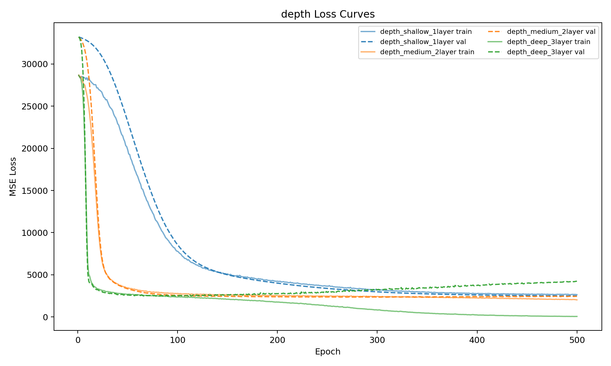
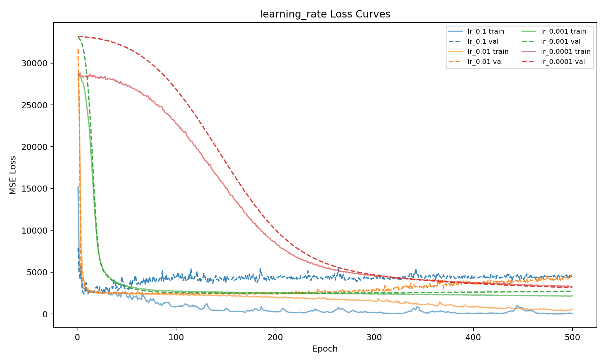
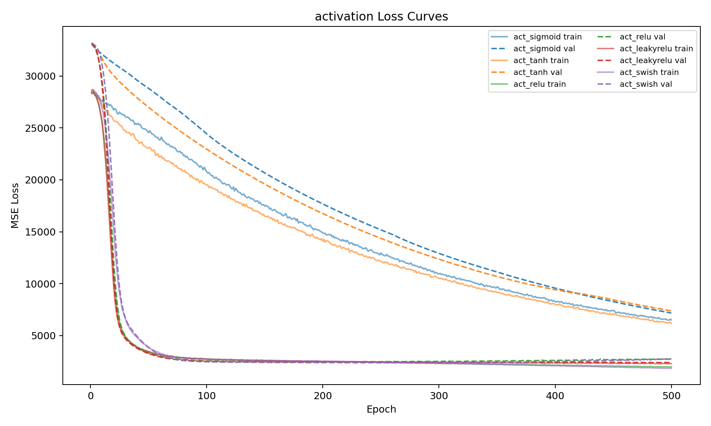

# 实验1 FNN 回归 实验报告

PB23000209赵文凯

## 1. 实验目的

使用前馈神经网络（FNN）完成Diabetes数据集的回归任务，并围绕以下三个因素进行对比实验：

1. 网络深度
2. 学习率
3. 激活函数

## 2. 数据集与预处理

- 数据集：Diabetes（442 条样本，10 维连续特征）
- 划分比例：训练/验证/测试 = 64% / 16% / 20%
- 预处理：使用训练集标准化拟合 `StandardScaler`，并对验证集和测试集做同样变换

## 3. 模型与训练配置

- 模型：FNN（输入层 10 维，输出层 1 维）
- 损失函数：MSE
- 优化器：Adam
- 批大小：32
- 训练轮数：500
- 随机种子：42
- 最优模型保存策略：按验证损失最小保存 checkpoint

## 4. 实验结果与分析

### 4.1 网络深度对比

固定设置：激活函数 ReLU，学习率 0.001，优化器 Adam。



| 网络结构             | Test Loss |  Test MSE | Test R2 |
| -------------------- | --------: | --------: | ------: |
| [128, 64, 32]（3层） | 2690.4919 | 2722.5359 |  0.4861 |
| [64, 32]（2层）      | 2716.9425 | 2746.2830 |  0.4817 |
| [32]（1层）          | 2843.9593 | 2870.7812 |  0.4582 |

分析：

1. 深层网络（3层）测试MSE最低，但在达到最优后继续训练存在过拟合风险。
2. 浅层网络（1层）测试指标明显落后，更接近欠拟合现象。
3. 三种深度网络差距不大，说明该任务在当前数据规模下，深度收益有限但仍存在。

### 4.2 学习率对比

固定设置：网络结构 [64, 32]，激活函数 ReLU。



| 学习率 | Test Loss |  Test MSE | Test R2 |
| ------ | --------: | --------: | ------: |
| 0.001  | 2658.5620 | 2686.3999 |  0.4930 |
| 0.01   | 2950.2915 | 2997.7756 |  0.4342 |
| 0.1    | 2956.2571 | 2997.9719 |  0.4341 |
| 0.0001 | 3686.1978 | 3686.8691 |  0.3041 |

分析：

1. `0.001` 在收敛速度和最终精度之间达到较好平衡，是本实验最优学习率。
2. `0.0001` 收敛较慢，在 500 epoch 内仍未达到较优区域。
3. `0.01` 与 `0.1` 在较大步长下更易出现优化震荡，最终泛化性能下降。

### 4.3 激活函数对比

固定设置：网络结构 [64, 32]，学习率 0.001。



| 激活函数  | Test Loss |  Test MSE | Test R2 |
| --------- | --------: | --------: | ------: |
| Swish     | 2633.8254 | 2655.9377 |  0.4987 |
| LeakyReLU | 2752.6838 | 2784.8596 |  0.4744 |
| ReLU      | 2762.2212 | 2788.0059 |  0.4738 |
| Sigmoid   | 5554.5092 | 5579.8208 | -0.0532 |
| Tanh      | 5735.9424 | 5774.2490 | -0.0899 |

分析：

1. Swish 最优，说明平滑非线性在该回归任务上有更好拟合效果。
2. LeakyReLU 与 ReLU 接近。
3. Sigmoid/Tanh 收敛较慢，500 个 epoch 内仍未进入稳定收敛区间，可能与梯度消失有关。

## 5. 总结

1. 在本任务中，3层网络略优于2层与1层，浅层网络存在欠拟合。
2. 学习率 `0.001` 显著优于 `0.1/0.01/0.0001`。
3. 激活函数方面 Swish 表现最佳，LeakyReLU 和 ReLU 次之，Sigmoid/Tanh 收敛过慢。

## 6. 复现命令

```bash
python experiments.py --epochs 500
```
