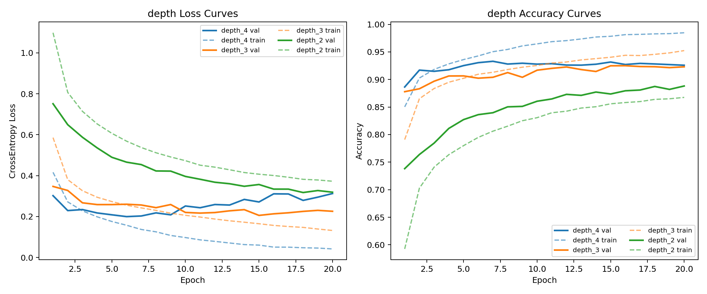
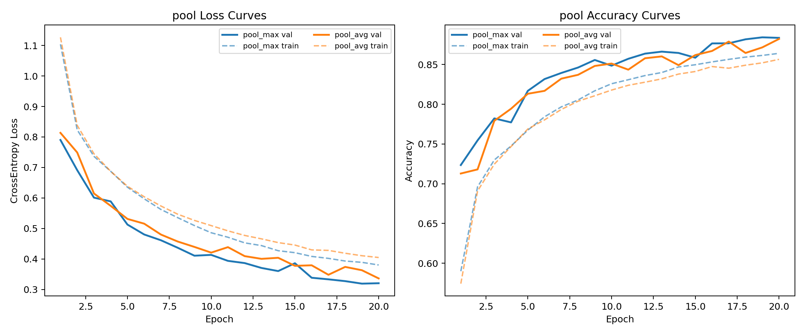
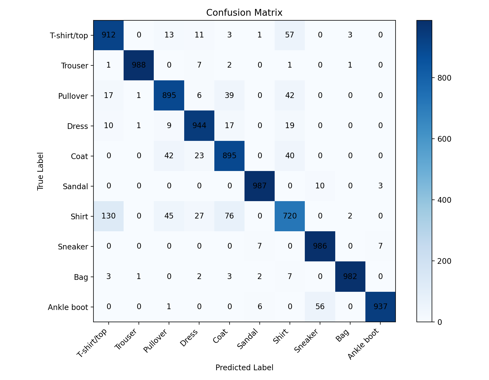
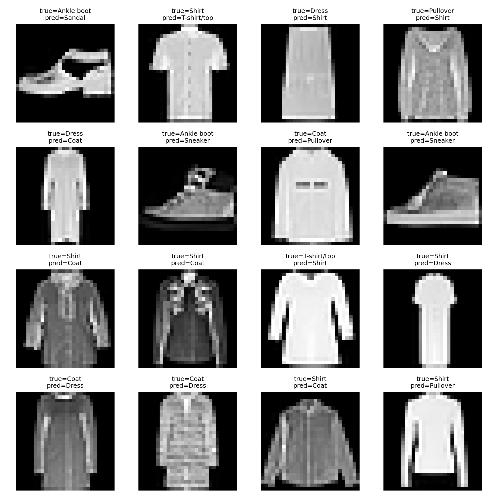

# 深度学习导论作业 1-2 实验报告

## 1. 实验任务

本实验以 Fashion-MNIST 数据集为对象，完成 CNN 图像分类任务，并通过控制变量法研究以下三个因素对模型性能的影响：

- 网络深度
- 卷积核大小
- 池化方式

## 2. 实验环境

- 操作系统：Ubuntu 24.04
- Python 版本：3.10.20
- 深度学习框架：PyTorch 2.11.0+cu130
- 训练设备：NVIDIA GeForce RTX 5060 Ti

## 3. 数据集与预处理

Fashion-MNIST 是一个常用的服饰图像分类数据集，共包含 10 个类别，图像均为 `28×28` 的单通道灰度图像。

- 样本规模：训练集 60,000 张，测试集 10,000 张。
- 验证集划分：从训练集中划分出 10%（6,000 张）作为验证集

数据预处理：

- 将图像转换为张量，并将像素值缩放到 $[0, 1]$
- 按 Fashion-MNIST 的像素均值和方差进行标准化

## 4. 模型设计

本实验实现了一个可配置的 CNN 分类器，基本结构为：

1. 多个卷积块串联，每个卷积块包含：
   `Conv2d + BatchNorm2d + ReLU + Pooling`
2. 特征提取结束后使用 `AdaptiveAvgPool2d` 将卷积层输出的特征图调整为固定尺寸
3. 特征展平后进入两层全连接网络。为了缓解过拟合，在全连接层之间设置了 Dropout 层

模型支持以下超参数配置：

- `conv_blocks`：卷积块数量
- `kernel_size`：卷积核大小
- `pool_type`：池化方式，`max` 和 `avg`
- `base_channels`：初始通道数
- `dropout`：全连接层 dropout 比例

## 5. 训练参数设置

实验使用以下配置：

```json
{
  "conv_blocks": 2,
  "base_channels": 32,
  "kernel_size": 3,
  "pool_type": "max",
  "dropout": 0.25,
  "learning_rate": 0.001,
  "batch_size": 64,
  "epochs": 20,
  "seed": 42,
  "sample_ratio": 1.0,
  "num_workers": 4,
  "device": "cuda"
}
```

## 6. 对比实验结果

### 6.1 网络深度实验

固定卷积核为 $3 \times 3$，池化方式为 Max Pooling：

| 模型    | conv_blocks | best_val_acc | test_acc | test_loss |
| ------- | ----------- | ------------ | -------- | --------- |
| depth_2 | 2           | 0.8882       | 0.8814   | 0.3293    |
| depth_3 | 3           | 0.9250       | 0.9184   | 0.2356    |
| depth_4 | 4           | 0.9330       | 0.9246   | 0.2422    |

增加网络深度对性能提升非常明显。从 2 层增加到 3 层时，测试精度提升了近 3.7%。这说明深层网络能够提取出更加复杂的特征信息。在本实验中，4 层结构表现最好，准确率最高。

不同网络深度下的训练与验证曲线见下图：



### 6.2 卷积核大小实验

固定卷积块数为 2，池化方式为 Max Pooling

| 模型     | kernel_size | best_val_acc | test_acc | test_loss |
| -------- | ----------- | ------------ | -------- | --------- |
| kernel_3 | 3           | 0.8870       | 0.8853   | 0.3255    |
| kernel_5 | 5           | 0.9068       | 0.9047   | 0.2674    |
| kernel_7 | 7           | 0.9120       | 0.9009   | 0.2705    |

在浅层网络中，较大的卷积核（如 $5 \times 5$）表现优于 $3 \times 3$。这是因为较大的卷积核感受野更大，更容易捕捉到服饰的整体轮廓。

### 6.3 池化方式实验

固定卷积块数为 2，卷积核为 $3 \times 3$：

| 模型     | pool_type | best_val_acc | test_acc | test_loss |
| -------- | --------- | ------------ | -------- | --------- |
| pool_max | max       | 0.8842       | 0.8853   | 0.3315    |
| pool_avg | avg       | 0.8822       | 0.8792   | 0.3422    |

最大池化能够保留图像中像素响应最强烈的部分（如边缘、突出的纹理），而平均池化则会对特征进行平滑，导致一些细节丢失。在服饰分类任务中，最大池化显然更合适。

不同池化方式下的训练与验证曲线见下图：



## 7. 错误样本与混淆矩阵分析

最佳模型（depth_4）的混淆矩阵见下图。



从混淆矩阵可以看出，模型对以下类别的识别效果较好：

- Trouser：`988/1000`
- Sandal：`987/1000`
- Sneaker：`986/1000`
- Bag：`982/1000`

这些类别在形状上较为稳定，与其他类别的视觉差异也较为明显，因此识别效果更好。

模型在部分类别之间仍存在较为典型的混淆现象：

- `Shirt` 容易被误判为 `T-shirt/top`，共有 `130` 个样本
- `T-shirt/top` 容易被误判为 `Shirt`，共有 `57` 个样本
- `Pullover` 和 `Coat` 之间存在明显混淆，分别有 `39` 和 `42` 个样本
- `Ankle boot` 与 `Sneaker` 之间也存在一定混淆，尤其是 `Ankle boot -> Sneaker` 有 `56` 个样本

推测造成上述现象的原因主要是：

- 部分类别在轮廓上较为接近，例如衬衫、T 恤、外套和套头衫均属于上衣类服饰
- Fashion-MNIST 图像分辨率较低，仅为 `28×28`，细节信息有限

部分错分样本见下图。



## 8. 实验结论

本实验围绕 Fashion-MNIST 图像分类任务构建并训练了卷积神经网络，并对网络深度、卷积核大小和池化方式进行了对比分析。实验结果表明：

- 增加网络深度能够显著提升模型性能，是本实验中影响最大的因素。
- 对于浅层网络，适当增大卷积核有助于提升分类准确率。
- 最大池化优于平均池化，更适合保留服饰图像中的关键局部特征。
- 错误分类主要发生在外观相似的上衣类服饰之间，说明模型已学到大部分有效特征，但仍受限于数据集分辨率和类别相似性。
