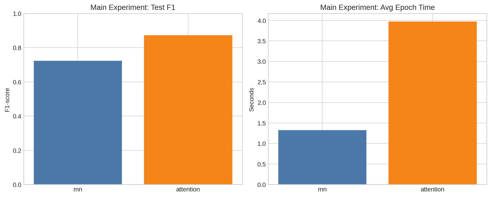
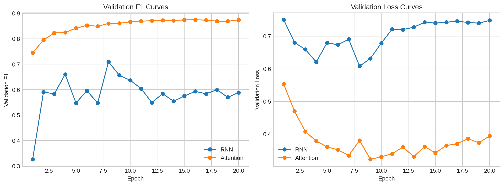
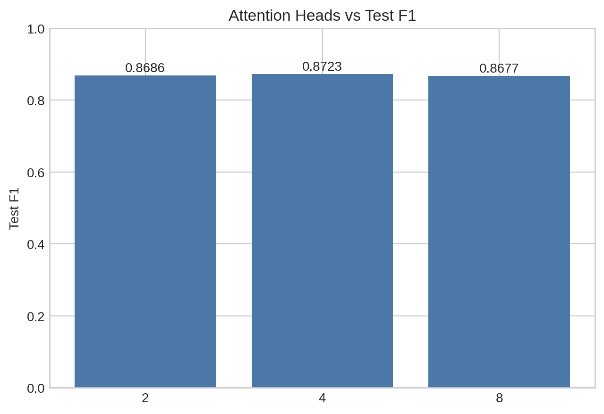
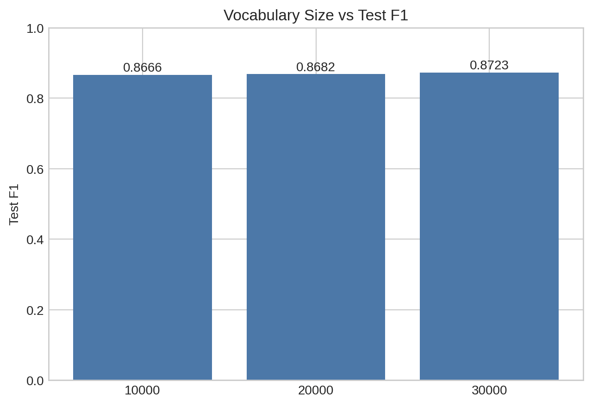
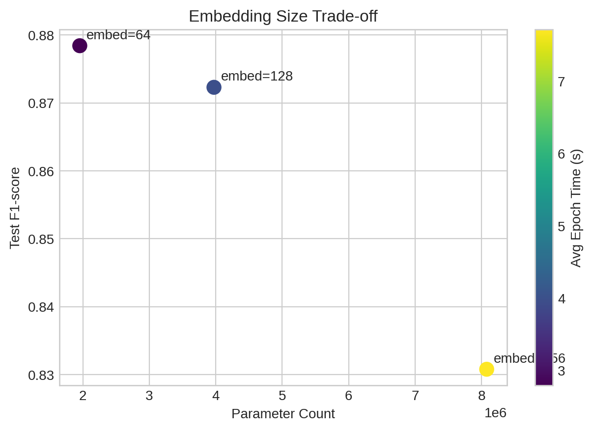
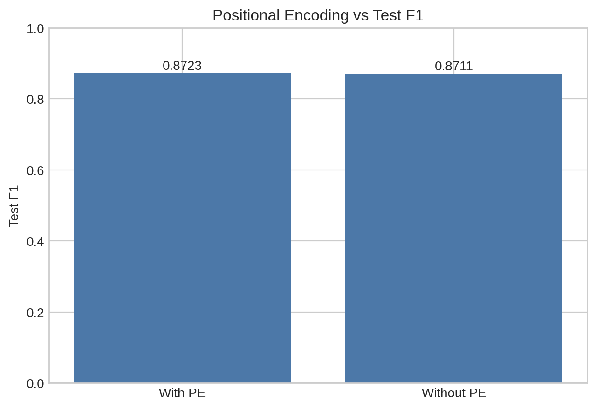
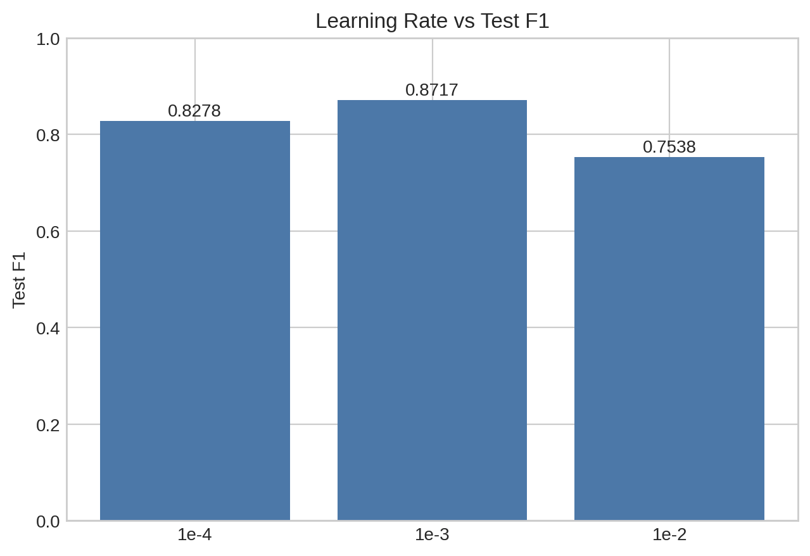
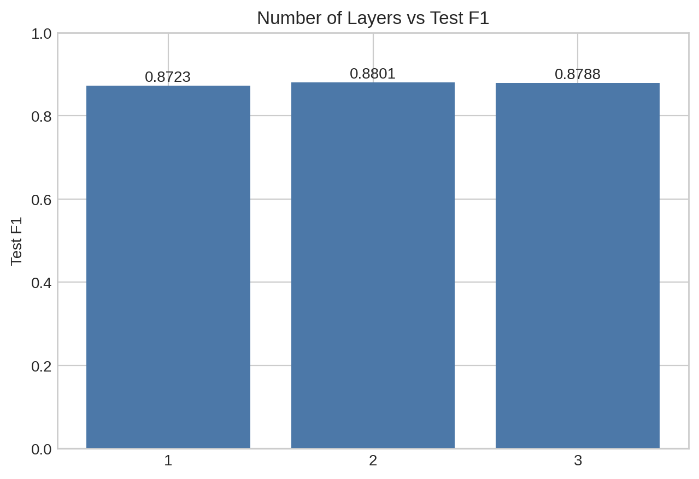

# 实验目的

使用 IMDB 影评数据集完成二分类情感分析任务，并围绕以下内容进行实验对比：

1. RNN 与 Attention 两类模型的性能与效率差异
2. Attention 模型中注意力头数对结果的影响
3. 词表大小对结果的影响
4. 嵌入维度对结果的影响
5. 学习率对结果的影响
6. 模型层数对结果的影响

此外，还补充了有无位置编码的对比实验，用于观察位置编码对本任务的影响。

# 数据集与预处理

- 数据集：IMDB Dataset（50,000 条英文影评，正负样本各 25,000 条）
- 划分比例：训练/验证/测试 = 72% / 8% / 20%
- 训练集样本数：36,000
- 验证集样本数：4,000
- 测试集样本数：10,000
- 文本预处理：全部转小写，将 ` ` 替换为空格，去除无关标点
- 词表构建：基于训练集词频统计，保留高频词并加入 `<pad>`、`<unk>`
- 序列处理：最长长度 200，过长截断，过短左侧补 `<pad>`

# 模型与训练配置

- 任务类型：二分类
- 损失函数：`BCEWithLogitsLoss`
- 优化器：Adam
- 学习率：0.001
- 批大小：128
- 训练轮数：20
- 模型保存策略：按验证集 `F1-score` 最优保存 checkpoint
- 评价指标：Accuracy、Precision、Recall、F1-score

## RNN 模型

- 词向量维度：128
- 隐藏层维度：128
- 层数：1
- dropout：0.2
- 结构：Embedding + 双向 `nn.RNN` + Linear
- 分类方式：取最后一个时间步隐藏状态进行分类

## Attention 模型

- 词向量维度：128
- 前馈隐藏层维度：256
- 层数：1
- 注意力头数：4
- dropout：0.2
- 结构：Embedding + 位置编码 + MultiheadAttention + FFN + LayerNorm
- padding mask：使用 `key_padding_mask` 屏蔽补齐位置

# 实验结果与分析

## RNN 与 Attention 主实验对比

固定设置：最大词表 30,000，最大序列长度 200，训练轮数 20。

说明：训练时间单位为 `s/epoch`，推理速度单位为 `samples/s`。

| 模型      |  参数量 |    Acc |   Prec |    Rec |     F1 |   Loss | 训练时间 |  推理速度 |
| --------- | ------: | -----: | -----: | -----: | -----: | -----: | --------: | --------: |
| RNN       | 3906305 | 0.7160 | 0.7059 | 0.7406 | 0.7228 | 0.5888 |   1.3425 | 155855.15 |
| Attention | 3972609 | 0.8674 | 0.8412 | 0.9058 | 0.8723 | 0.3680 |   3.9679 |  44529.30 |

分析：

1. Attention 在 Accuracy、Recall 和 F1-score 上均明显优于 RNN，测试集 `F1-score` 从 `0.7228` 提升到 `0.8723`，更适合 IMDB 这类较长文本的情感分类任务。
2. 两个模型参数量接近，RNN 为 `3906305`，Attention 为 `3972609`，因此性能差距主要来自建模方式，而不是模型规模差异。
3. RNN 的训练和推理速度明显更快，平均每轮训练时间仅 `1.34s`，Attention 约为 `3.97s`。因此，RNN 在效率上占优，但性能明显落后。
4. 综合来看，Attention 在效果上显著更优，RNN 则更适合作为轻量级基线模型。

## 训练过程观察

分析：

1. RNN 在前期收敛较快，但验证集表现波动明显。在第 8 个 epoch 验证集 `F1` 达到 `0.7095` 后，没有继续稳定提升，到第 20 个 epoch 已下降到 `0.5886`，表明其泛化能力较弱，训练稳定性不足。
2. Attention 的训练过程更平滑。验证集 `F1` 从第 1 个 epoch 的 `0.7447` 逐步提升，在第 13 个 epoch 达到 `0.8723`，后续基本保持在 `0.87` 左右，表明 20 个 epoch 时模型已经基本收敛。
3. 因此，在本实验中 RNN 更像是一个能够快速训练的基础模型，而 Attention 不仅效果更好，训练过程也更稳定。

## 附加实验：注意力头数对比

固定设置：Attention 模型其余参数不变，仅调整 `num_heads`。

说明：训练时间单位为 `s/epoch`。

| Attention 头数 |    Acc |   Prec |    Rec |     F1 |   Loss | 训练时间 |
| -------------- | -----: | -----: | -----: | -----: | -----: | -------: |
| 2              | 0.8684 | 0.8675 | 0.8696 | 0.8686 | 0.3367 |   3.4257 |
| 4              | 0.8674 | 0.8412 | 0.9058 | 0.8723 | 0.3680 |   4.0096 |
| 8              | 0.8667 | 0.8611 | 0.8744 | 0.8677 | 0.3672 |   5.4221 |

分析：

1. `4` 头取得了最高的 `F1-score = 0.8723`，说明在本任务中适中的头数更有利于兼顾多子空间表示与训练稳定性。
2. `2` 头的 Accuracy 略高于 `4` 头，但 `F1-score` 略低，表明其整体分类表现已经接近最优，只是在正负样本平衡上略逊于 `4` 头。
3. `8` 头没有继续带来收益，训练时间反而明显增加，说明头数并不是越多越好。

## 附加实验：词表大小对比

固定设置：Attention 模型结构不变，仅调整最大词表大小。

| 最大词表大小 |  参数量 |    Acc |   Prec |    Rec |     F1 |   Loss |
| ------------ | ------: | -----: | -----: | -----: | -----: | -----: |
| 10000        | 1412609 | 0.8651 | 0.8569 | 0.8766 | 0.8666 | 0.3620 |
| 20000        | 2692609 | 0.8669 | 0.8598 | 0.8768 | 0.8682 | 0.3594 |
| 30000        | 3972609 | 0.8674 | 0.8412 | 0.9058 | 0.8723 | 0.3680 |

分析：

1. 随着词表增大，模型效果整体略有提升，其中 `30000` 词表取得最高 `F1-score = 0.8723`。
2. `10000` 与 `20000` 的表现已经较接近，说明中等规模词表已经能够覆盖 IMDB 任务中的大部分常用情感词汇。
3. 从参数量上看，词表大小对模型规模影响明显，`30000` 词表参数量约为 `10000` 词表的 2.8 倍，因此继续增大词表带来的收益存在但有限。

## 附加实验：嵌入维度对比

固定设置：以 Attention 基线模型为基础，比较不同嵌入维度；其中为保证多头注意力可整除并控制前馈层规模，部分配置同步调整了 `num_heads` 或 `hidden_dim`。

说明：训练时间单位为 `s/epoch`。

| 嵌入维度 |  参数量 |    Acc |   Prec |    Rec |     F1 |   Loss | 训练时间 |
| -------- | ------: | -----: | -----: | -----: | -----: | -----: | -------: |
| 64       | 1953537 | 0.8750 | 0.8550 | 0.9032 | 0.8784 | 0.3453 |   2.7946 |
| 128      | 3972609 | 0.8674 | 0.8412 | 0.9058 | 0.8723 | 0.3680 |   3.9819 |
| 256      | 8076033 | 0.8314 | 0.8338 | 0.8278 | 0.8308 | 0.4557 |   7.7136 |

分析：

1. 在这组配置中，`embed_dim = 64` 的结果最好，测试集 `F1-score` 达到 `0.8784`，同时训练速度也是三组中最快的。
2. `embed_dim = 256` 并没有带来更好结果，反而性能下降且训练耗时显著增加，说明在当前任务和数据规模下，更大的表示维度未必能带来更好的泛化效果。
3. 需要注意的是，本组实验并非严格单变量对照：`embed_dim = 64` 时同步使用了 `hidden_dim = 128`，`embed_dim = 256` 时同步使用了 `num_heads = 8`。因此，这里的结论更适合解释为不同嵌入规模下的整体配置权衡，而不是仅由嵌入维度单独造成的差异。

## 附加实验：位置编码对比

固定设置：Attention 基线模型结构不变，仅比较是否加入 sinusoidal 位置编码。

| 位置编码 |    Acc |   Prec |    Rec |     F1 |   Loss |
| -------- | -----: | -----: | -----: | -----: | -----: |
| 使用     | 0.8674 | 0.8412 | 0.9058 | 0.8723 | 0.3680 |
| 不使用   | 0.8699 | 0.8629 | 0.8796 | 0.8711 | 0.4061 |

分析：

1. 两种设置的性能非常接近，说明对于长度截断到 200 的 IMDB 任务，即使不显式加入位置编码，模型也能通过词序统计学习到部分顺序信息。
2. 使用位置编码时 `F1-score` 略高，而不使用位置编码时 Accuracy 略高，但 Loss 更大。
3. 综合来看，位置编码仍然是本实验中更稳妥的设置：虽然提升幅度不大，但在 `F1-score` 和 Loss 上表现更稳定。

## 附加实验：学习率对比

固定设置：Attention 基线模型结构不变，仅比较不同学习率。

说明：训练时间单位为 `s/epoch`。

| 学习率 |    Acc |   Prec |    Rec |     F1 |   Loss | 训练时间 |
| ------ | -----: | -----: | -----: | -----: | -----: | -------: |
| 1e-4   | 0.8127 | 0.7661 | 0.9002 | 0.8278 | 0.4103 |   4.1340 |
| 1e-3   | 0.8698 | 0.8590 | 0.8848 | 0.8717 | 0.3738 |   4.0985 |
| 1e-2   | 0.7381 | 0.7112 | 0.8018 | 0.7538 | 0.5375 |   4.1053 |

分析：

1. `1e-3` 取得了最佳综合表现，测试集 `F1-score = 0.8717`，能够较好地兼顾收敛速度与最终效果。
2. `1e-4` 的 Recall 较高，但整体 Accuracy 和 F1-score 明显偏低，说明学习率过小时优化过程偏慢，在 20 个 epoch 内仍未达到更优解。
3. `1e-2` 的表现明显下降，说明学习率过大时参数更新过于剧烈，更容易造成训练震荡和泛化性能下降。

## 附加实验：层数对比

固定设置：Attention 基线模型其余参数不变，仅比较不同层数。

说明：训练时间单位为 `s/epoch`。

| 层数 |  参数量 |    Acc |   Prec |    Rec |     F1 |   Loss | 训练时间 |
| ---- | ------: | -----: | -----: | -----: | -----: | -----: | -------: |
| 1    | 3972609 | 0.8674 | 0.8412 | 0.9058 | 0.8723 | 0.3680 |   4.0734 |
| 2    | 4105089 | 0.8771 | 0.8591 | 0.9022 | 0.8801 | 0.3802 |   7.5381 |
| 3    | 4237569 | 0.8786 | 0.8775 | 0.8800 | 0.8788 | 0.3567 |  10.6097 |

分析：

1. 增加层数后模型效果整体有所提升，`2` 层和 `3` 层的 `F1-score` 都高于单层模型，说明更深的注意力结构能够带来一定的表示能力增益。
2. `2` 层取得了最高的 `F1-score = 0.8801`，而 `3` 层在 Accuracy 上略高，但 F1-score 略低于 `2` 层，说明继续加深层数后收益已经开始减弱。
3. 层数增加带来的训练成本十分明显，平均每轮训练时间从 `4.07s` 增加到 `10.61s`，因此 `2` 层在性能与效率之间更具平衡性。

# 总结

1. 在 IMDB 情感分析任务中，Attention 明显优于基础 RNN。20 个 epoch 下，Attention 测试集 `F1-score` 达到 `0.8723`，而 RNN 为 `0.7228`。
2. 从效率上看，RNN 训练和推理更快，但性能明显落后；Attention 训练更慢，但泛化能力更强。
3. 在附加实验中，`4` 头注意力取得最佳综合表现，说明头数增加并不会无限提升效果。
4. 词表大小增大能够带来一定收益，但提升有限；在效果与模型规模之间需要权衡。
5. 嵌入维度实验表明 `64` 维是本实验的最优配置，在性能、参数量和训练速度之间取得了更好的平衡。
6. 学习率实验表明 `1e-3` 是更合适的选择，过大或过小都会导致性能下降。
7. 层数实验表明适当加深模型可以提升性能，其中 `2` 层在效果与训练开销之间更平衡。
8. 位置编码对性能有小幅帮助，但不是决定性因素。

# 复现实验命令

完整实验命令已整理在 [experiment_commands.txt](/home/wenkai/deeplearning/LAB3-RNN/experiment_commands.txt:1) 中，可直接批量运行。
图表可通过 [generate_report_figures.py](/home/wenkai/deeplearning/LAB3-RNN/generate_report_figures.py:1) 自动从 `outputs/` 中生成到 `assets/` 目录。
