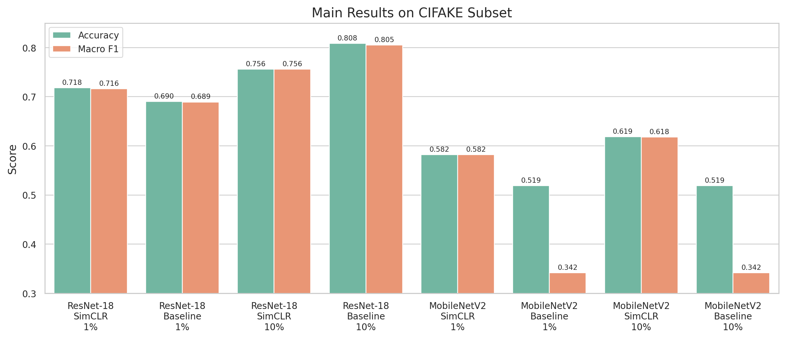
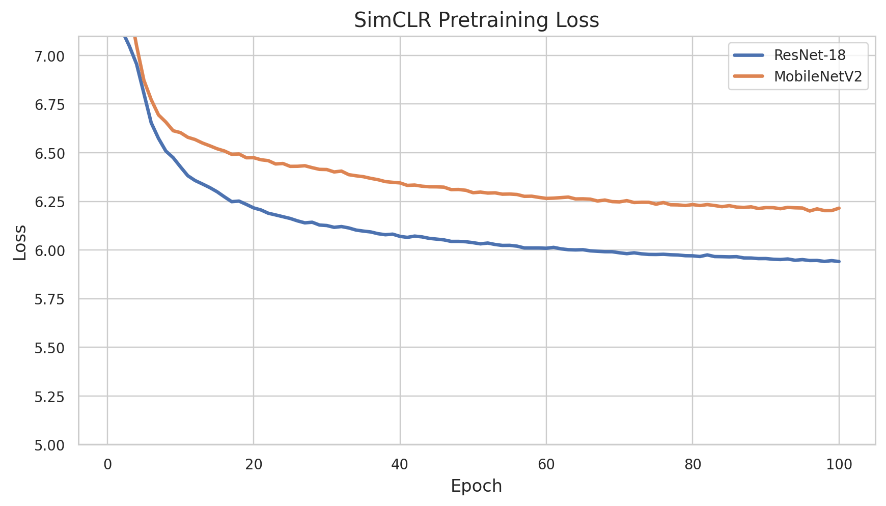
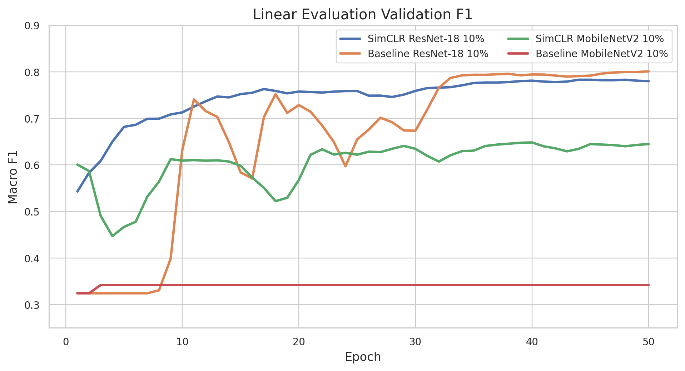
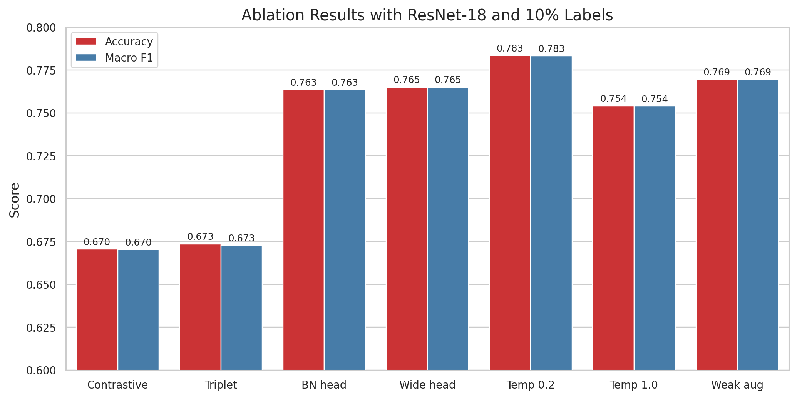

# 深度学习导论实验4：基于 SimCLR 的 AIGC 生成图像检测

赵文凯 PB23000209

## 1. 实验任务与数据集

本实验使用 CIFAKE 数据集做二分类，把 CIFAR-10 中的真实图像记为 `REAL`，把 Stable Diffusion 生成图像记为 `FAKE`。数据集采用 `ImageFolder` 目录结构，原始训练集包含 100000 张图像，测试集包含 20000 张图像。考虑到需要同时完成主实验和多组附加实验，本文使用 `sample_ratio=0.1`，即抽取 10% 数据参与训练和测试，满足题目“不少于总数据量 10%”的要求。

在本次设置下，训练划分如下：抽样后训练部分共 10000 张，其中 9000 张用于训练、1000 张用于验证；测试集抽样后为 2000 张。冻结线性评估时，1% 标注比例约使用 90 张带标签训练图像，10% 标注比例约使用 900 张带标签训练图像。

受训练时间限制，本文没有使用全量 CIFAKE，而是采用 10% 子集完成所有主实验和附加实验。为了减少子集实验的不稳定性，所有实验固定随机种子为 42，并保持相同的数据划分、batch size 和训练轮数。本文更关注不同方法之间的相对趋势，而不是追求最高绝对指标。

## 2. 方法

本实验使用 SimCLR 框架进行自监督表示学习。预训练阶段不使用类别标签，对同一张图像生成两个随机增强视图，并将它们作为正样本对；同一 batch 中其他图像的视图作为负样本。模型由 Encoder 和 Projection Head 两部分组成。Encoder 提取 128 维图像表示，Projection Head 将其映射到 64 维对比学习空间用于计算损失。下游评估阶段丢弃 Projection Head，冻结 Encoder，仅训练一个单层线性分类器完成 `FAKE` / `REAL` 二分类。

数据增强使用 torchvision 实现。强增强包含随机裁剪、水平翻转、随机旋转、颜色抖动、随机灰度化和高斯模糊；弱增强降低颜色抖动强度，取消高斯模糊，并降低灰度化概率。两种增强都保留 32x32 输入尺寸，并使用 CIFAR 风格均值与标准差归一化。

主要损失函数为手写实现的 NT-Xent。设一个 batch 中有 N 张原图，经过两路增强后得到 2N 个投影向量。每个样本以另一路增强结果为正样本，以剩余 2N-2 个向量为负样本，通过温度系数缩放余弦相似度并计算交叉熵损失。附加实验中还实现并比较了 Contrastive Loss 和 Triplet Loss。

## 3. 模型结构

本实验比较了 ResNet-18 和 MobileNetV2 两种轻量级 Encoder。ResNet-18 针对 32x32 图像进行了调整：第一层卷积改为 3x3、stride=1、padding=1，并移除原始 max pooling，以避免过早降低小尺寸图像的空间分辨率；最后全连接层输出 128 维特征。MobileNetV2 使用原始倒残差结构，将分类头替换为输出 128 维特征的线性层。

Projection Head 默认结构为 `Linear(128,128) -> ReLU -> Linear(128,64)`。附加实验还测试了加入 BatchNorm 的版本，以及隐藏层扩展为 256 维的 wide 版本。

## 4. 实验设置

| 配置项 | 取值 |
|---|---:|
| sample_ratio | 0.1 |
| batch_size | 1024 |
| pretrain_epochs | 100 |
| linear_epochs | 50 |
| optimizer | AdamW |
| learning_rate | 0.002 |
| weight_decay | 0.0001 |
| feature_dim | 128 |
| projection_dim | 64 |
| 默认 temperature | 0.5 |
| 默认 Projection Head | plain |
| 默认数据增强 | strong |
| 随机种子 | 42 |

## 5. 主实验结果

主实验比较 SimCLR 预训练后冻结线性评估与随机初始化 baseline。指标为测试集 Accuracy 和 macro F1 Score。

| Encoder | 评估方式 | 标注比例 | Accuracy | F1 Score |
|---|---|---:|---:|---:|
| ResNet-18 | SimCLR + frozen linear | 1% | 0.7180 | 0.7159 |
| ResNet-18 | Baseline from scratch | 1% | 0.6900 | 0.6893 |
| ResNet-18 | SimCLR + frozen linear | 10% | 0.7560 | 0.7560 |
| ResNet-18 | Baseline from scratch | 10% | 0.8085 | 0.8052 |
| MobileNetV2 | SimCLR + frozen linear | 1% | 0.5820 | 0.5819 |
| MobileNetV2 | Baseline from scratch | 1% | 0.5190 | 0.3417 |
| MobileNetV2 | SimCLR + frozen linear | 10% | 0.6185 | 0.6178 |
| MobileNetV2 | Baseline from scratch | 10% | 0.5190 | 0.3417 |

从结果看，ResNet-18 在本实验设置下整体优于 MobileNetV2。对于 1% 标注数据，ResNet-18 的 SimCLR 冻结评估明显高于 baseline，Accuracy 从 0.6900 提升到 0.7180，这说明自监督预训练在极低标注比例下确实提供了额外信息；但在 10% 标注比例下，ResNet-18 baseline 反而更高，说明当标注样本增加后，端到端监督训练可以更直接地适配二分类目标。

MobileNetV2 的 baseline 结果明显异常，Accuracy 为 0.5190，macro F1 只有 0.3417，接近只预测单一类别的结果。由于 SimCLR 冻结评估下 MobileNetV2 能达到 0.6178 F1，数据本身并没有明显问题，更可能是当前端到端 baseline 的优化设置不适合 MobileNetV2。因此本文不把 MobileNetV2 baseline 作为模型优劣的唯一依据，后续分析主要参考 SimCLR 线性评估和 ResNet-18 的对比。

预训练损失曲线显示，ResNet-18 与 MobileNetV2 的 NT-Xent loss 都在前几十个 epoch 明显下降，后期趋于平稳，没有出现发散。ResNet-18 的最终预训练 loss 为 5.9408，MobileNetV2 为 6.2003；ResNet-18 下游线性评估表现也更好，二者趋势一致。

线性评估曲线进一步显示，ResNet-18 baseline 在 10% 标注数据下验证 F1 上升最快，最终也取得最高测试指标；MobileNetV2 baseline 长期停留在较低 F1，没有有效学到二分类边界，而 SimCLR 预训练能让 MobileNetV2 的线性评估结果更稳定。

## 6. 附加实验

附加实验均使用 ResNet-18，在 10% 标注比例下进行冻结线性评估。

### 6.1 不同 Loss 的影响

| Loss | Pretrain best loss | Accuracy | F1 Score | 结论 |
|----|----:|---:|---:|------|
| NT-Xent | 5.9408 | 0.7560 | 0.7560 | 默认 SimCLR 损失，整体优于替代 loss |
| Contrastive Loss | 0.0546 | 0.6705 | 0.6703 | 表示质量明显下降 |
| Triplet Loss | 0.0070 | 0.6735 | 0.6727 | 略优于 Contrastive，但仍低于 NT-Xent |

NT-Xent 在本任务上效果最好。一个可能原因是 NT-Xent 显式利用 batch 内所有负样本进行归一化对比，更适合 SimCLR 的大 batch 训练设定；而 Triplet / Contrastive Loss 当前实现只构造了较有限的负样本关系，监督信号较弱。

### 6.2 Projection Head 结构分析

| Projection Head | Pretrain best loss | Accuracy | F1 Score | 结论 |
|----|----:|---:|---:|------|
| plain | 5.9408 | 0.7560 | 0.7560 | 默认两层 MLP |
| batchnorm | 5.9042 | 0.7635 | 0.7635 | 优于 plain，BatchNorm 改善投影空间稳定性 |
| wide | 5.9067 | 0.7650 | 0.7650 | 本组中最优，隐藏层容量增加带来小幅提升 |

Projection Head 结构会影响下游线性可分性。加入 BatchNorm 后 Accuracy 从 0.7560 提升到 0.7635，wide 版本进一步达到 0.7650。说明适当提高 Projection Head 的稳定性或容量，可以让 Encoder 学到更适合下游任务的表示，但提升幅度小于温度系数和增强策略的影响。

### 6.3 温度系数影响

| Temperature | Pretrain best loss | Accuracy | F1 Score | 结论 |
|---:|----:|---:|---:|----|
| 0.2 | 3.7032 | 0.7835 | 0.7833 | 最优，显著优于默认 0.5 |
| 0.5 | 5.9408 | 0.7560 | 0.7560 | 默认设置，表现稳定 |
| 1.0 | 6.7553 | 0.7540 | 0.7539 | 温度偏高，区分度下降 |

在本组实验里，温度系数的影响最明显。把 temperature 从 0.5 调到 0.2 后，Accuracy 从 0.7560 提升到 0.7835。较小温度会放大相似度差异，使模型更关注 hard negatives；温度为 1.0 时相似度分布更平滑，正负样本区分压力降低，最终指标低于 0.2。

### 6.4 数据增强强度影响

| Augmentation | Pretrain best loss | Accuracy | F1 Score | 结论 |
|----|----:|---:|---:|------|
| strong | 5.9408 | 0.7560 | 0.7560 | 增强更丰富，但可能破坏部分判别细节 |
| weak | 5.8993 | 0.7695 | 0.7695 | 本任务下更优 |

弱增强在本实验中优于强增强。这也符合 CIFAKE 的特点：图像只有 32x32，真实图像与生成图像之间的差异可能体现在纹理、颜色统计和局部伪影上，过强的颜色扰动和模糊可能会把本来就很弱的伪影线索抹掉。

## 7. 讨论

本实验结果表明，SimCLR 可以在低标注比例下学习到有效的视觉表示，尤其在 ResNet-18 的 1% 标注设置下，预训练使 Accuracy 从 0.6900 提升到 0.7180；在 MobileNetV2 的 baseline 训练失败时，预训练表征也明显改善了 F1 Score。但 SimCLR 并不总是优于端到端监督训练：在 ResNet-18、10% 标注比例下，baseline 达到 0.8085 Accuracy，高于默认 SimCLR 的 0.7560。这说明自监督预训练的收益与标注比例、模型结构、增强策略和下游训练方式有关。

从附加实验看，NT-Xent 是更适合 SimCLR 的损失函数，温度系数是影响最大的超参数之一，temperature=0.2 将 Accuracy 提升到 0.7835；Projection Head 使用 BatchNorm 或更宽隐藏层也能带来小幅增益。对于 CIFAKE 这种小尺寸伪造图像检测任务，弱增强反而优于强增强，说明增强策略需要结合任务特征设计，而不是越强越好。

## 8. 总结

本实验完成了 SimCLR 的完整训练流程，包括双视图数据增强、Encoder + Projection Head 构建、NT-Xent 损失手写实现、冻结线性评估和 baseline 对比。实验结果显示，ResNet-18 是当前设置下更合适的 Encoder；默认 SimCLR 在 1% 标注比例下明显优于 baseline，但 10% 标注比例下不如端到端监督训练。附加实验中，temperature=0.2 获得最佳 SimCLR 下游结果，Accuracy 为 0.7835，F1 Score 为 0.7833；弱数据增强也取得了 0.7695 Accuracy，说明针对小尺寸 AIGC 检测任务保留局部判别细节很重要。
